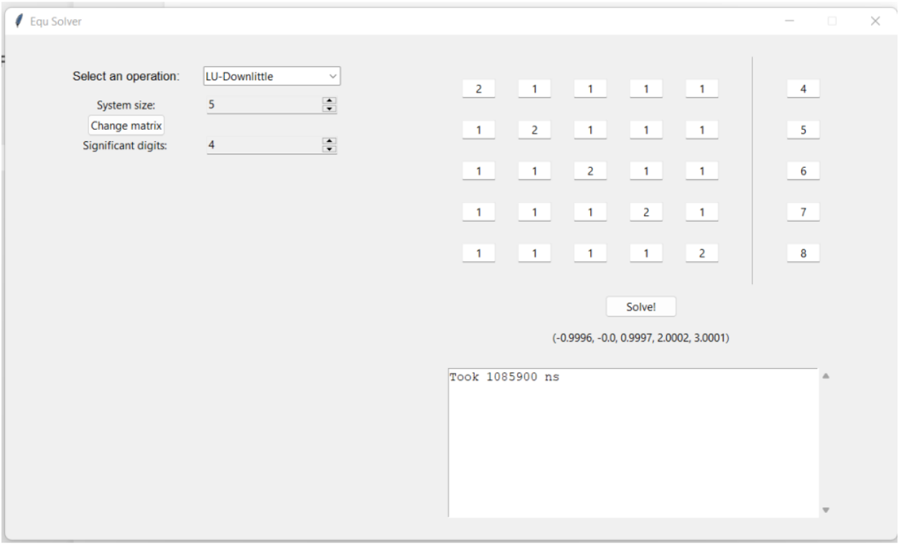
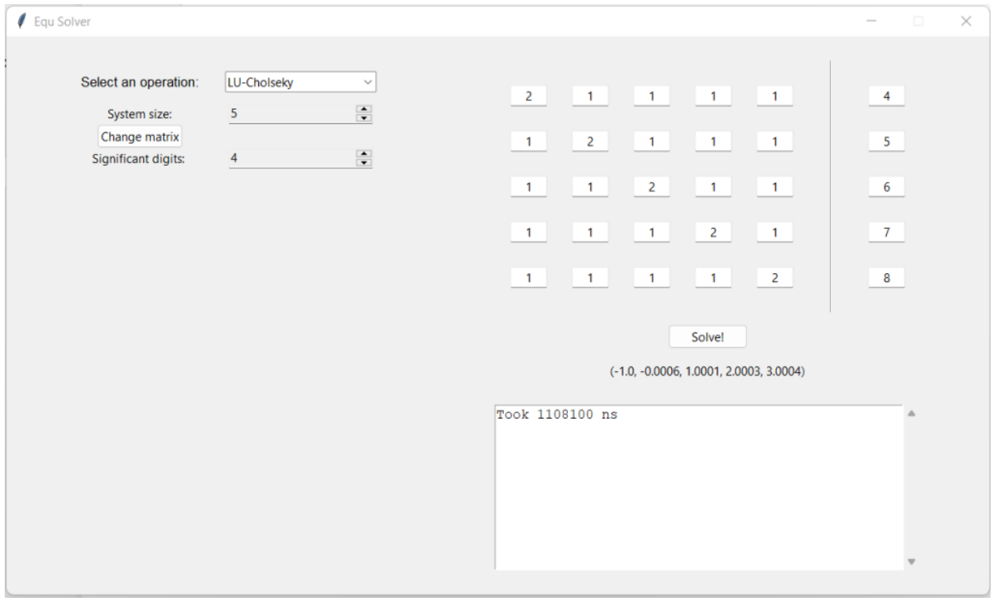
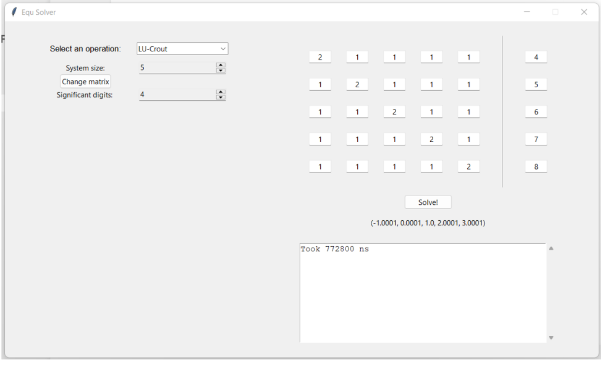
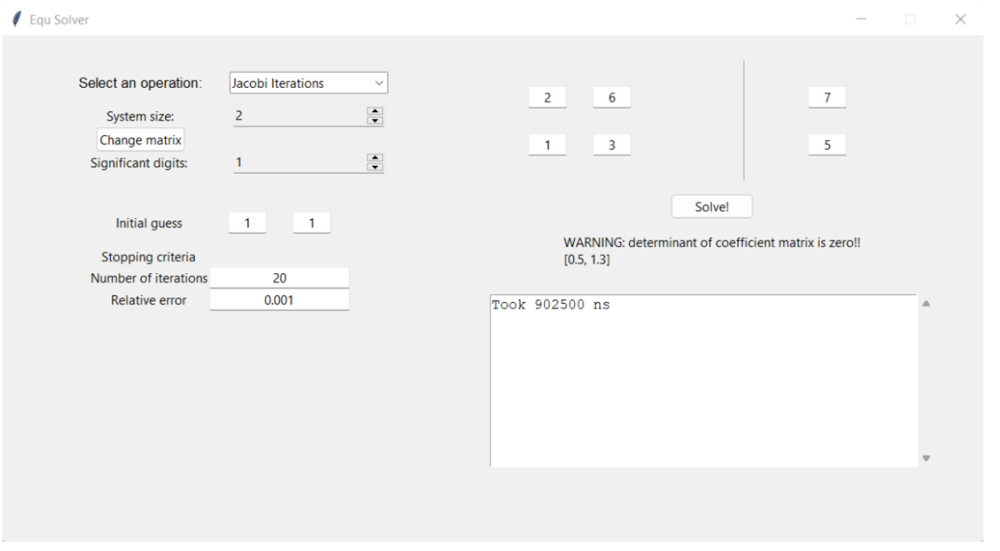
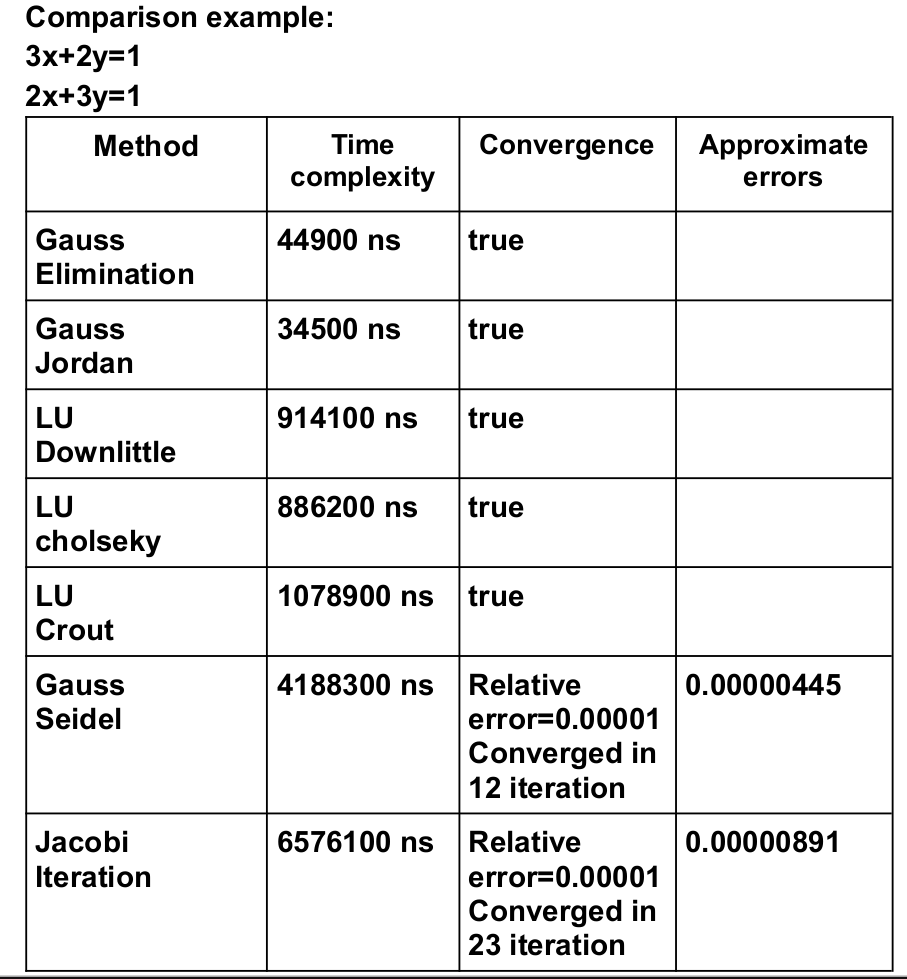

# Equation-Solver-and-Root-Finder
a program to solve linear equations and to find the root of polynomial equations using well known direct and iterative methods 

## Methods implemented to solve linear equations
### Direct Methods 
1. Naive Gauss elimination
2. Gauss-Jordan elimination
3. LU decompositions:
  1. Doolittle's decomposition
  2. Cholseky' decomposition
  3. Crout's decomposition
### iterative Methods
1. Gauss-Seidel Method
2. Jacobi Iterations

## Methods implemented to find roots of polynomial equations
### Bracketing Methods
1. Bisections method
2. False Position method

### Open Methods
1. Fixed Point iterations
2. Newton-Raphson method
3. Secant method

## Implementation Details
* Program is fully developed in Python 
* Python liberaries as `numpy`, `sympy` and `matplotlib` are used to process given input and internal calculations and to plot the output of the calculated solutions
* GUI liberary `tkinter` is used to make a simple user interface for the program

## Screenshots
### Linear equation solver

### Root Finder

